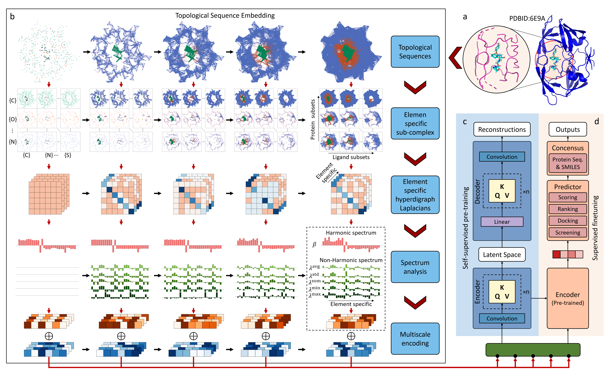

# TopoFormer

**Title** - TopoFormer: Topological Transformer for Enhanced Protein-Ligand Interaction Prediction
**Authors** - Dong Chen, Guo-wei Wei

---

## Table of Contents

- [TopoFormer](#topoformer)
  - [Table of Contents](#table-of-contents)
  - [Introduction](#introduction)
  - [Model Architecture](#model-architecture)
  - [Getting Started](#getting-started)
    - [Prerequisites](#prerequisites)
    - [Installation](#installation)
  - [Datasets](#datasets)
  - [Fine-Tuning Procedure for Customized Data](#fine-tuning-procedure-for-customized-data)
  - [Results](#results)
      - [Pretrained models](#pretrained-models)
      - [Finetuned models and performances](#finetuned-models-and-performances)
  - [License](#license)
  - [Citation](#citation)
  - [Acknowledgements](#acknowledgements)

---

## Introduction

Topological transformer, namely TopoFormer, an innovative model anchored in the persistent topological Laplacian, which stands as a beacon within transformer-based architectures. By translating protein-ligand complexes into sequences of topological objects, TopoFormer harnesses a vast reservoir of unlabeled data before refining its capabilities on labeled datasets. This logical progression ensures exemplary **scoring** accuracy, further evidenced by its superior performance in **ranking**, **docking**, and **screening** tasks via a number of benchmark datasets.

---

## Model Architecture

The overall architecture of the model is shown in below.



Further explain the details in the [paper](https://pubs.acs.org/doi/full/10.1021/acs.jpclett.1c03058), providing context and additional information about the architecture and its components.

---

## Getting Started

### Prerequisites

- transformers              4.24.0
- numpy                     1.21.5
- scipy                     1.7.3
- pytorch                   1.13.1
- pytorch-cuda              11.7
- scikit-learn              1.0.2
- python                    3.9.12

### Installation

```
git clone https://github.com/WeilabMSU/TopoFormer.git
```

---

## Datasets

A brief introduction about the benchmarks.

| | Datasets                    | Training Set                 | Test Set                                             |
|-|-----------------------------|------------------------------|------------------------------                        |
|Pre-training | Combind PDBbind |19513 [RowData](www), [TopoFeature_small](https://weilab.math.msu.edu/Downloads/TopoFormer/TopoFeature_small.zip), [TopoFeature_large](https://weilab.math.msu.edu/Downloads/TopoFormer/TopoFeature_large.zip)  |                                          |
|Finetuning   | CASF-2007       |1105  [Label](https://weilab.math.msu.edu/Downloads/TopoFormer/Benchmarks_labels.zip)                        | 195 [Label](https://weilab.math.msu.edu/Downloads/TopoFormer/Benchmarks_labels.zip)                         |
|             | CASF-2013       |2764  [Label](https://weilab.math.msu.edu/Downloads/TopoFormer/Benchmarks_labels.zip)                        | 195 [Label](https://weilab.math.msu.edu/Downloads/TopoFormer/Benchmarks_labels.zip)                         |
|             | CASF-2016       |3772  [Label](https://weilab.math.msu.edu/Downloads/TopoFormer/Benchmarks_labels.zip)                        | 285 [Label](https://weilab.math.msu.edu/Downloads/TopoFormer/Benchmarks_labels.zip)                         |
|             | PDB v2016       |3767  [Label](https://weilab.math.msu.edu/Downloads/TopoFormer/Benchmarks_labels.zip)                        | 290 [Label](https://weilab.math.msu.edu/Downloads/TopoFormer/Benchmarks_labels.zip)                         |
|             | PDB v2020       |18904 [Label](https://weilab.math.msu.edu/Downloads/TopoFormer/Benchmarks_labels.zip)<br> (exclude core sets)| 195 [Label](https://weilab.math.msu.edu/Downloads/TopoFormer/Benchmarks_labels.zip)<br>(CASF-2007 core set) |
|             |                 |                              | 195 <br>(CASF-2013 core set) |
|             |                 |                              | 285 <br>(CASF-2016 core set) |
|             |                 |                              | 285 <br>(v2016 core set)     |

- RowData: the protein-ligand complex structures. From PDBbind
- TopoFeature: the topological embedded features for the protein-ligand complex. All features are saved in a dict, which `key` is the protein ID, and `value` is the topological embedded features for corresponding complex. The downloaded file is .zip file, which contains two file (1) `TopoFeature_large.npy`: topological embedded features with a filtration parameter ranging from 0 to 10 and incremented in steps of 0.1 \AA; (2) `TopoFeature_small.npy`: topological embedded features with a filtration parameter ranging from 2 to 12 and incremented in steps of 0.2 \AA; 
- Label: the .csv file, which contains the protein ID and corresponding binding affinity.

---

## Fine-Tuning Procedure for Customized Data

```shell
bs=32 # batch size
lr=0.00008  # learning rate
ms=10000  # max training steps
fintuning_python_script=./code_pkg/topt_regression_finetuning.py
model_output_dir=./outmodel_finetune_for_regression
mkdir $model_output_dir
pretrained_model_dir=./pretrained_model
scaler_path=./code_pkg/pretrain_data_standard_minmax_6channel_large.sav
validation_data_path=./CASF_2016_valid_feat.npy
train_data_path=./CASF_2016_train_feat.npy
validation_label_path=./CASF2016_core_test_label.csv
train_label_path=./CASF2016_refine_train_label.csv

# finetune for regression on one GPU
CUDA_VISIBLE_DEVICES=1 python $fintuning_python_script --hidden_dropout_prob 0.1 --attention_probs_dropout_prob 0.1 --num_train_epochs 100 --max_steps $ms --per_device_train_batch_size $bs --base_learning_rate $lr --output_dir $model_output_dir --model_name_or_path $pretrained_model_dir --scaler_path $scaler_path --validation_data $validation_data_path --train_data $train_data_path --validation_label $validation_label_path --train_label $train_label_path --pooler_type cls_token --random_seed 1234 --seed 1234;
```


```shell
# script for no validation data and validation label
# docking and screening
bs=32 # batch size
lr=0.0001  # learning rate
ms=5000  # max training steps
fintuning_python_script=./code_pkg/topt_regression_finetuning_docking.py
model_output_dir=./outmodel_finetune_for_docking
mkdir $model_output_dir
pretrained_model_dir=./pretrained_model
scaler_path=./code_pkg/pretrain_data_standard_minmax_6channel_filtration50-12.sav
train_data_path=./train_feat.npy
train_label_path=./train_label.csv

# finetune for regression on one GPU
CUDA_VISIBLE_DEVICES=1 python $fintuning_python_script --hidden_dropout_prob 0.1 --attention_probs_dropout_prob 0.1 --num_train_epochs 100 --max_steps $ms --per_device_train_batch_size $bs --base_learning_rate $lr --output_dir $model_output_dir --model_name_or_path $pretrained_model_dir --scaler_path /$scaler_path --train_data $train_data_path --train_label $train_label_path --validation_data None --validation_label None --train_val_split 0.1 --pooler_type cls_token --random_seed 1234 --seed 1234 --specify_loss_fct 'huber';
```


---

## Results

#### Pretrained models
- Pretrained TopoFormer model large. [Download](https://weilab.math.msu.edu/Downloads/TopoFormer/TopoFormer_s_pretrained_model.zip)
- Pretrained TopoFormer model small. [Download](https://weilab.math.msu.edu/Downloads/TopoFormer/TopoFormer_pretrained_model.zip)

#### Finetuned models and performances
- Scoring


| Finetuned for scoring                                                | Training Set                  | Test Set| PCC | RMSE (kcal/mol) |
|-------------------------------------------------                     |-------------                  |---------|-    |-                |
| CASF-2007 [result](./Results)      | 1105                          | 195     |0.836|1.815|
| CASF-2007 small [result](./Results)| 1105                          | 195     |0.838|1.807|
| CASF-2013 [result](./Results)      | 2764                          | 195     |0.817|1.858|
| CASF-2016 [result](./Results)      | 3772                          | 285     |0.865|1.561|
| PDB v2016 [result](./Results)      | 3767                          | 290     |0.866|1.561|
| PDB v2020 [result](./Results)      | 18904 <br> (exclude core sets)|195<br>CASF-2007 core set|0.857|1.737|
|                                    |                               |195<br>CASF-2013 core set|0.842|1.761|
|                                    |                               |285<br>CASF-2016 core set|0.876|1.526|

Note, there are 20 TopoFormers are trained for each dataset with distinct random seeds to address initialization-related errors. And 20 gradient boosting regressor tree (GBRT) models are subsequently trained one these sequence-based features, which predictions can be found in the [results](./Results) folder. Then, 10 models were randomly selected from TopoFormer and GBDT models, respectively, to obtain their respective consensus results, and finally the average of the two types of consensus predictions was used as the final prediction result. The performance shown in the table is the average result of this process performed 400 times.

- Docking


| Finetuned for docking                                                | Success rate |
|-------------------------------------------------                     |-             |
| CASF-2007 [result](./Results)| 93.3%         |
| CASF-2013 [result](./Results)| 91.3%         |

- Screening

| Finetuned for screening                                              |Success rate on 1%|Success rate on 5%|Success rate on 10%|EF on 1%|EF on 5%|EF on 10%|
|-                                                                     | - | - | - | - | - | - |
| CASF-2013 |68%|81.5%|87.8%|29.6|9.7|5.6|

Note, the EF here means the enhancement factor. Each target protein has a finetuned model. [result](./Results) contains all predictions.

---

## License

This project is licensed under the MIT License - see the [LICENSE](LICENSE) file for details.

---

## Citation

If you use this code or the pre-trained models in your work, please cite our work. 
- Chen, Dong, Guo-Wei Wei. "TopoFormer: Topological Transformer for Enhanced Protein-Ligand Interaction Prediction."

---

## Acknowledgements

This project has benefited from the use of the [Transformers](https://github.com/huggingface/transformers) library. Portions of the code in this project have been modified from the original code found in the Transformers repository.
